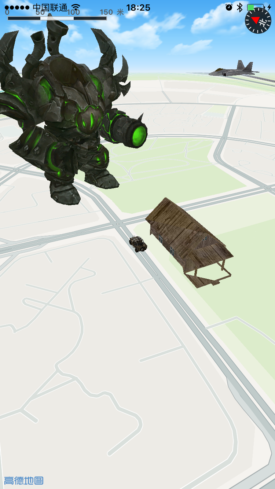

iOS_Map_Game
===============
本工程主要介绍了 高德地图iOS SDK 3D版本 在基于地图的游戏方面的应用。

##前述：

- [高德官方网站申请key](http://id.amap.com/?ref=http%3A%2F%2Fapi.amap.com%2Fkey%2F).
- 阅读[参考手册](http://a.amap.com/lbs/static/unzip/iOS_Map_Doc/AMap_iOS_API_Doc_3D/index.html).
- 如果有任何疑问也可以发问题到[官方论坛](http://lbsbbs.amap.com/portal.php).

##效果图如下:

* 


##使用方法：

**1.搭建高德地图 iOSSDK 工程方法见**
[地图SDK使用方法](http://lbs.amap.com/api/ios-sdk/summary/)

**2.OPENGL接口回调以及缩放比例**

地图SDK使用OPENGL实现,可通过继承MAOverlayRenderer类并重写glRender方法获取OPENGL渲染时的每帧回调接口。

- 初始化AMap对象及获取OPENGL绘制回调
``` objc
/**
* 初始化MAMapView对象
*/
- (void)createMapView
{
    MAMapView *_mapView = [[MAMapView alloc] initWithFrame:self.view.bounds];
    
    ///不允许降帧
    _mapView.isAllowDecreaseFrame = NO;

    ///关闭楼快
    _mapView.showsBuildings = NO;

    ///不显示文字
    _mapView.showsLabels = NO;

    ///设置地图模式
    _mapView.mapType = MAMapTypeNavi;
}
```

- 地图开放每桢回调及坐标转换

``` objc
///重写referenceDidChange,当地图坐标系发生改变的时候，会调用此方法。在此方法中重新转换中心点经纬度至坐标点
- (void)referenceDidChange
{
    [super referenceDidChange];
    ///可获取经纬度对应的当前坐标系的坐标点
    self.centerInGL = [self glPointForMapPoint:MAMapPointForCoordinate(self.overlay.coordinate)];
}

///重写glRender方法可获得每帧回调(Overlay被添加进mapView以后)
- (void)glRender
{
    ///保存矩阵，用于只修改当前模型的矩阵
    glPushMatrix();

    ///使用坐标点进行平移，即可把Overlay移动至对应的地图位置上
    glTranslatef(self.centerInGL.x, self.centerInGL.y, self.centerInGL.z);

    ///恢复之前矩阵
    glPopMatrix();
}


```
